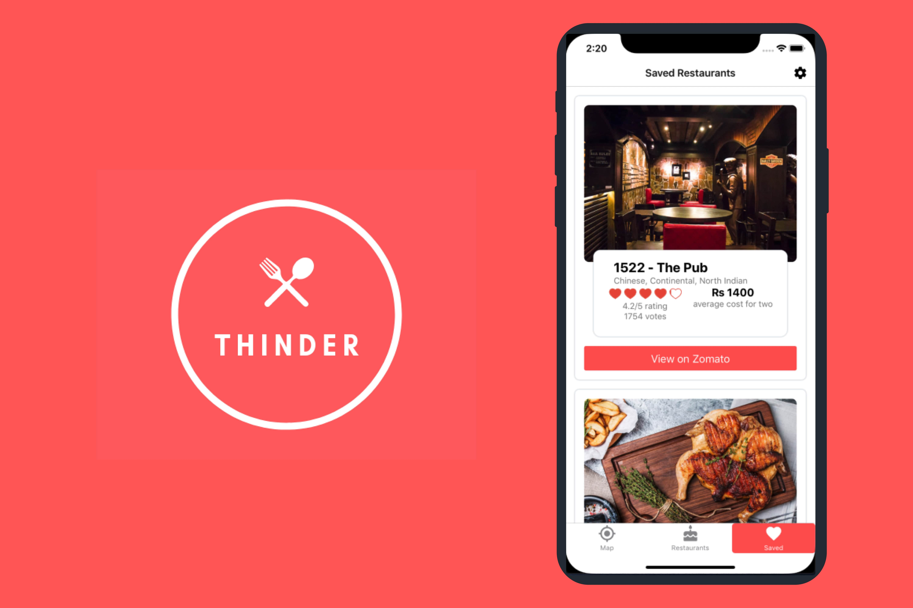
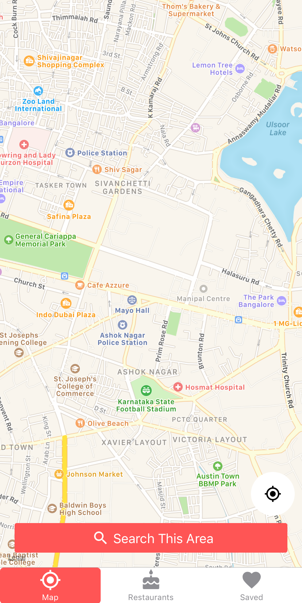
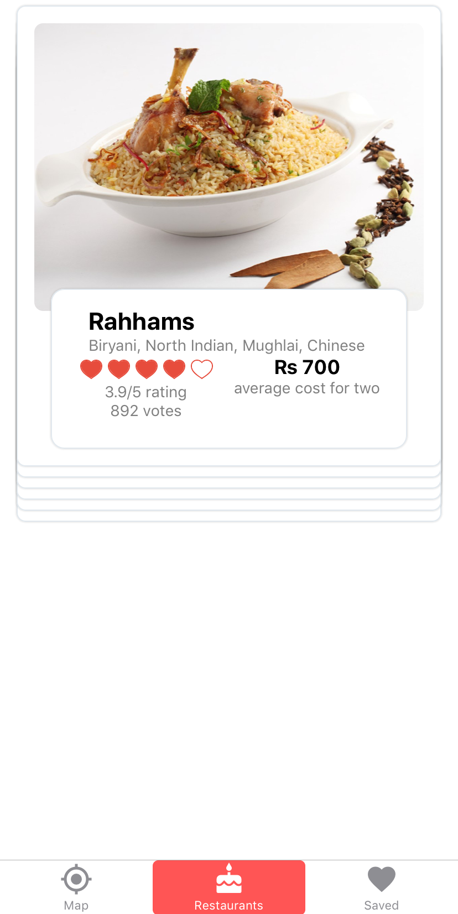
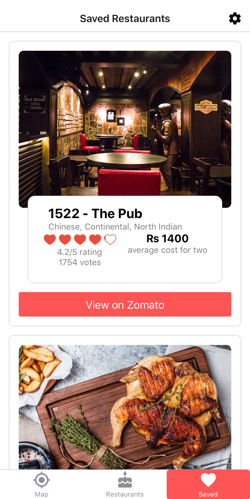

# An App that lets you decide where to eat on a whim

I've been learning a lot of React Native lately and I thought I could put that to good use by creating a fun little app. I've decided to call the app 'Thinder'. The word Thinder comes from the Kannada word 'Thindi' or 'ತಿಂಡಿ' meaning dish or snack and it is a play on the word Tinder because I'm using my own implementation of their swipable cards UX.

The app basically uses Zomato's Nearby Restaurants API where it takes the latitude and longitude location and provides the details of 9 of the highest rated restaurants nearby. 

## The Interface

The Interface is created in a way where there a set of onboarding screens explaining the functionality of the app and how to use it. (credit to [www.undraw.co](http://www.undraw.co) for those beautiful illustrations.) Then the user is directed to a TabView where the first tab contains the MapView of the current location and area where the user can pan around to whatever area they would like to search in.

The MapView Screen where the user can pan around and search for restaurants in the desired area.

The second tab contains the swipe-able deck of cards that I created looking at some Dribbble designs. The user can swipe left to dismiss and swipe right to save the card for later. 

The Restaurants Screen that contains the cards with the information about the restaurants

The third tab is the Saved Restaurants Screen. This screen contains all the cards that the user swiped right on so that they can make a decision on which restaurant they finally want to go to. It also contains a deep link to the corresponding saved restaurants in Zomato where the user can explore more about the restaurant like its reviews, menu, distance etc. The app itself is limited in functionality, it's all about the user wanting to make a quick decision based on the first thought that comes to their mind but we also link to Zomato should the user want to explore their options more deeply.

The Saved Restaurants Screen containing the Cards and the Deep Link to Zomato of each of the saved restaurants.

The data that is saved is persisted onto memory using redux-persist. This way if the user closes the app and returns to the app at a later time, the restaurants selected will still be available to them. There is also functionality for the user to clear the saved restaurants in a separate Settings Screen accessible by clicking on the top right of the Saved Restaurants screen header.

## Conclusion

Overall, I had a great time learning how to make this app. There is no better way to learn a library/framework than getting into building real world applications with it. Reading and re-reading specs and documentation on React, React-Native, Redux and React-Navigation in order to incorporate features that I wanted and customise minor UI elements to suit the color theme was something that helped accelerate my rate of learning considerably. 

The application is  currently live on the Play Store. You can check it out at [https://play.google.com/store/apps/details?id=com.nikhilasrani.thinder&hl=en](https://play.google.com/store/apps/details?id=com.nikhilasrani.thinder&hl=en) and the source code is live at my github at [https://github.com/nikhilasrani/thinder](https://github.com/nikhilasrani/thinder)
